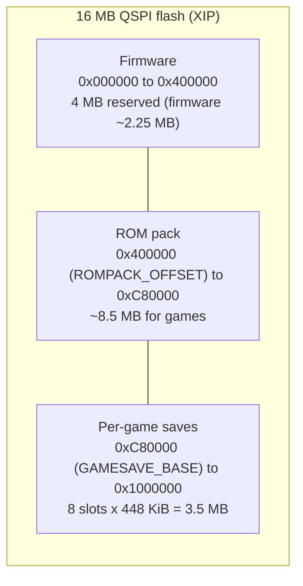
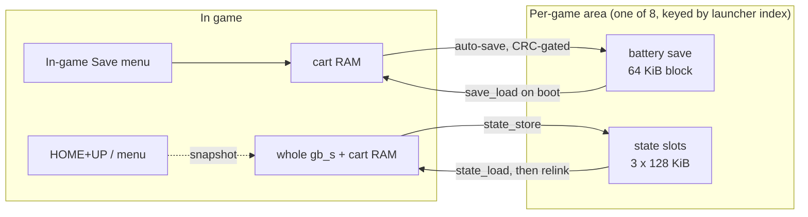

# Architecture

BadgeBoy is a single bare-metal application. A ROM is emulated by Peanut-GB,
rendered to a framebuffer, and pushed to the ST7789 panel. There is no operating
system, no scheduler, and no dynamic allocation in the run loop. As of v0.7 the
firmware hosts an on-device launcher: a built-in game plus any games from a
separately flashed ROM pack, each with its own save area.

## Data flow

```mermaid
flowchart TD
    ROM["gb_rom[] in flash"] --> CORE
    CORE["Peanut-GB core<br/>gb_run_frame()"] -->|draw_line() per scanline| FB
    FB["framebuffer priv.fb<br/>160x144 RGB565, byte-swapped"] --> BLIT
    BLIT["lcd_blit_gb()<br/>nearest-neighbour scale"] --> PIO
    PIO["PIO + DMA<br/>8080 parallel ST7789"] --> PANEL["320x240 panel"]
    INPUT["read_joypad()<br/>5 buttons to 8 inputs"] -->|once per frame| CORE
```

Input is read once per frame and written to the Peanut-GB joypad register.

## Flash layout

The 16 MB on-board flash is split into three independent regions, each flashed
on its own. Offsets are from the start of flash (`0x10000000`, `XIP_BASE`) and
are defined in `src/flash_layout.h`.



- **Firmware** (`0x000000` to `0x400000`): the `.uf2` built by `build.sh`. 4 MB
  is reserved; the actual firmware is about 2.25 MB.
- **ROM pack** (`0x400000`, `ROMPACK_OFFSET`, up to `0xC80000`): the game
  library, flashed separately by `tools/pack_roms.py`. About 8.5 MB.
- **Per-game saves** (`0xC80000`, `GAMESAVE_BASE`, to the top `0x1000000`): 8
  game slots (`GAMESAVE_MAX`) of 448 KiB each. Each slot holds one 64 KiB
  battery-save block plus three 128 KiB save-state slots. 8 times 448 KiB fills
  exactly to the top of flash.

The firmware and the ROM pack are separate flash images. Reflashing the game
library writes only the pack region and leaves the firmware and the saves in
place, and the reverse. See [FLASHING.md](FLASHING.md).

### ROM pack format

The pack is built on the host by `tools/pack_roms.py` and emitted directly as a
flashable `.uf2`. It uses UF2 family id `0xe48bff57` (the RP2 "absolute"
family), which the RP2350 BOOTSEL accepts and writes at the absolute pack
address without disturbing the firmware. The tool derives clean display titles
from the file names (stripping bracketed and parenthesized dump tags), marks CGB
versus DMG, and 4 KiB-aligns each ROM.

The on-flash format (little endian, see `src/flash_layout.h`) is a header
`{magic 0x4B504242 "BBPK", version, count, reserved}`, then `count` entries
`{char title[32], uint32 offset, uint32 size, uint8 flags (bit0 = CGB), pad}`,
then the ROM data. The firmware reads the pack in place from memory-mapped flash
(XIP); it is not copied to RAM. Parsing lives in `src/rompack.c`.

## ROM browser and launcher

`main.c` builds the game list at boot. The firmware's built-in ROM (the one
embedded at build time via `GBC_ROM`) is game index 0; any pack games are
appended after it. The total is capped at 8 so each game gets its own save area,
keyed by launcher index.

- With a single game, the firmware launches straight in.
- With more than one game, or after Exit to menu, it shows the launcher, which
  lists each game's title and a CGB or DMG tag.
- Switching games is a soft reset: the emulator re-initialises in place via
  `run_game()`, with no device reboot.

Each launcher index selects its own per-game save area through
`save_set_game(index)`, so games never overwrite one another's saves. See
[SAVES.md](SAVES.md).

## Save and state flow

Two independent persistence paths share one flash storage layer (`src/save.c`).
Both operate on the active game's per-game save area, selected by
`save_set_game(launcher_index)`.



Each game's saves live in its own 448 KiB slot in the flash region above the ROM
pack (`GAMESAVE_BASE`), not in a single shared region. A battery save is stored
as a header `{magic 0x56534242 "BBSV", version, rom_id, size}` followed by the
SRAM bytes; `rom_id` is an FNV-1a hash of ROM header bytes `0x134` to `0x14F`, so
a save never loads for the wrong game.

The auto-save policy (`run_game` in `src/main.c`) commits the battery save to
flash a short time after the game's SRAM writes settle (about 1.2 s of quiet),
or after the data has been dirty for a few seconds for games that write SRAM
continuously. It is rate limited to at most once every few seconds and skipped
by a CRC check when nothing changed. Exit to menu force-flushes the battery save
first. See [SAVES.md](SAVES.md) for the full mechanics and troubleshooting
notes.

## Components

### Emulator core

`third_party/peanut-gb/peanut_gb.h`, the `cgb` branch of Peanut-GB. It emulates
the Sharp LR35902 CPU, the PPU, timers, interrupts, and the memory bank
controllers. BadgeBoy provides four callbacks: ROM read, cart RAM read, cart RAM
write, and an error handler. Game Boy Color support is enabled by defining
`PEANUT_FULL_GBC_SUPPORT` to 1 before including the header. Sound is disabled
with `ENABLE_SOUND` 0 because the badge has no speaker.

### Frame rendering

The core calls `draw_line()` once per visible scanline with 160 pixel indices.

- In Game Boy Color mode, each pixel indexes `gb->cgb.fixPalette`, a 15-bit
  RGB555 entry. `main.c` converts it to RGB565, optionally through the Gambatte
  color-correction matrix so colors match the real CGB LCD.
- In DMG mode, each pixel is a 2-bit shade mapped through one of four selectable
  palettes.

Each pixel is byte swapped to big-endian as it is written, so the panel blit can
stream the framebuffer without per-pixel work.

### Display driver

`src/tufty_lcd.c` plus `src/st7789_parallel.pio`. The ST7789 is driven over an
8-bit parallel 8080 bus.

- A small PIO program shifts one byte per FIFO entry onto the data pins and
  toggles WR to latch it. DMA feeds the PIO FIFO, so bulk pixel writes do not
  occupy the CPU.
- CS and DC are ordinary software-driven outputs.
- Because the data bus is on GPIO 32-39 and WR on GPIO 30, the PIO sets its GPIO
  base to 16 so it can address GPIO 16-47. See HARDWARE.md.
- The initialisation sequence and register values follow Pimoroni's ST7789
  driver for the 320x240 panel. MADCTL is set for a 180 degree rotation because
  the panel is mounted rotated.
- `lcd_blit_gb()` scales the 160x144 framebuffer into the configured window with
  a precomputed nearest-neighbour column map, streaming one output row at a time.

### Input

`read_joypad()` in `src/main.c` reads the five active-low buttons and produces
the Game Boy joypad byte. C acts as a shift modifier so that Left, Right, Start,
and Select are reachable without dedicated buttons.

### Main loop

`main()` initialises stdio, the display, and the buttons, then builds the game
list (built-in game index 0 plus any pack games from `src/rompack.c`). With a
single game it auto-launches; with more than one, or after Exit to menu, it shows
the launcher and lets the player pick. The chosen game runs in `run_game()`,
which selects the per-game save area, calls `gb_init` and `gb_init_lcd`, loads
any battery save, then loops: read input, run one or more frames (fast-forward
runs several per blit), blit, persist saves when due, and pace to roughly
59.7 Hz. HOME is a function modifier for speed, color correction, save states,
and the menu; HOME+C opens the modal in-game menu, which pauses the game and
includes Exit to menu (which flushes the battery save and returns to the
launcher). Switching games is a soft reset in place; there is no device reboot.
If `gb_init` fails, the backlight pulses as a visible error signal.

## Memory

- The active ROM lives in flash and is read through the `gb_rom_read` callback.
  The built-in ROM is the embedded `GBC_ROM` array; pack games are read in place
  from the memory-mapped ROM pack at `ROMPACK_OFFSET`. Neither is copied to RAM.
- Cart RAM, the framebuffer, and the Peanut-GB state live in SRAM. Cart RAM is
  persisted to the active game's per-game battery block (above `GAMESAVE_BASE`)
  by `src/save.c`, and reloaded on boot. Save-state snapshots store the whole
  `gb_s` plus cart RAM to that game's numbered state slots.

## Why bare metal and not a MicroPython app

The badge runs MicroPython (MonaOS), but a per-frame Python callback cannot keep
up with real-time Game Boy emulation. Peanut-GB is C and needs direct hardware
access for the PIO display path, so BadgeBoy is its own firmware image. The cost
is that it replaces MonaOS while running; MonaOS is restored by reflashing.

## Extending

See [ROADMAP.md](../ROADMAP.md). Battery saves, save states, display shaders, the
ROM browser, and per-game saves are done. ROM storage is settled: games live in a
separately flashed ROM pack (`tools/pack_roms.py`, `src/rompack.c`,
`src/flash_layout.h`) that the firmware reads in place, and saves are split into
per-game areas (`src/save.c`). The remaining roadmap items are NES support (a
second console core behind a console abstraction) and a dual-boot launcher that
offers MonaOS or BadgeBoy at power-on.
