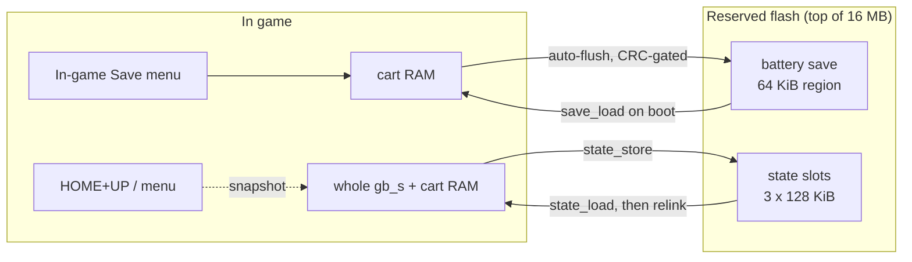

# Architecture

BadgeBoy is a single bare-metal application. One ROM is emulated by Peanut-GB,
rendered to a framebuffer, and pushed to the ST7789 panel. There is no operating
system, no scheduler, and no dynamic allocation in the run loop.

## Data flow

```mermaid
flowchart TD
    ROM["gb_rom[] in flash"] --> CORE
    CORE["Peanut-GB core<br/>gb_run_frame()"] -->|draw_line() per scanline| FB
    FB["framebuffer priv.fb<br/>160x144 RGB565, byte-swapped"] --> BLIT
    BLIT["lcd_blit_gb()<br/>nearest-neighbour scale"] --> PIO
    PIO["PIO + DMA<br/>8080 parallel ST7789"] --> PANEL["320x240 panel"]
    INPUT["read_joypad()<br/>5 buttons to 8 inputs"] -->|once per frame| CORE
```

Input is read once per frame and written to the Peanut-GB joypad register.

## Save and state flow

Two independent persistence paths share one flash storage layer (`src/save.c`).



## Components

### Emulator core

`third_party/peanut-gb/peanut_gb.h`, the `cgb` branch of Peanut-GB. It emulates
the Sharp LR35902 CPU, the PPU, timers, interrupts, and the memory bank
controllers. BadgeBoy provides four callbacks: ROM read, cart RAM read, cart RAM
write, and an error handler. Game Boy Color support is enabled by defining
`PEANUT_FULL_GBC_SUPPORT` to 1 before including the header. Sound is disabled
with `ENABLE_SOUND` 0 because the badge has no speaker.

### Frame rendering

The core calls `draw_line()` once per visible scanline with 160 pixel indices.

- In Game Boy Color mode, each pixel indexes `gb->cgb.fixPalette`, a 15-bit
  RGB555 entry. `main.c` converts it to RGB565, optionally through the Gambatte
  color-correction matrix so colors match the real CGB LCD.
- In DMG mode, each pixel is a 2-bit shade mapped through one of four selectable
  palettes.

Each pixel is byte swapped to big-endian as it is written, so the panel blit can
stream the framebuffer without per-pixel work.

### Display driver

`src/tufty_lcd.c` plus `src/st7789_parallel.pio`. The ST7789 is driven over an
8-bit parallel 8080 bus.

- A small PIO program shifts one byte per FIFO entry onto the data pins and
  toggles WR to latch it. DMA feeds the PIO FIFO, so bulk pixel writes do not
  occupy the CPU.
- CS and DC are ordinary software-driven outputs.
- Because the data bus is on GPIO 32-39 and WR on GPIO 30, the PIO sets its GPIO
  base to 16 so it can address GPIO 16-47. See HARDWARE.md.
- The initialisation sequence and register values follow Pimoroni's ST7789
  driver for the 320x240 panel. MADCTL is set for a 180 degree rotation because
  the panel is mounted rotated.
- `lcd_blit_gb()` scales the 160x144 framebuffer into the configured window with
  a precomputed nearest-neighbour column map, streaming one output row at a time.

### Input

`read_joypad()` in `src/main.c` reads the five active-low buttons and produces
the Game Boy joypad byte. C acts as a shift modifier so that Left, Right, Start,
and Select are reachable without dedicated buttons.

### Main loop

`main()` initialises stdio, the display, and the buttons, calls `gb_init` and
`gb_init_lcd`, loads any battery save, then loops: read input, run one or more
frames (fast-forward runs several per blit), blit, persist saves when due, and
pace to roughly 59.7 Hz. HOME is a function modifier for speed, color correction,
save states, and the menu; HOME+C opens the modal in-game menu, which pauses the
game. If `gb_init` fails, the backlight pulses as a visible error signal.

## Memory

- The ROM lives in flash and is read through the `gb_rom_read` callback. It is
  not copied to RAM.
- Cart RAM, the framebuffer, and the Peanut-GB state live in SRAM. Cart RAM is
  persisted to a reserved flash region by `src/save.c`, and reloaded on boot.
  Save-state snapshots store the whole `gb_s` plus cart RAM to numbered slots.

## Why bare metal and not a MicroPython app

The badge runs MicroPython (MonaOS), but a per-frame Python callback cannot keep
up with real-time Game Boy emulation. Peanut-GB is C and needs direct hardware
access for the PIO display path, so BadgeBoy is its own firmware image. The cost
is that it replaces MonaOS while running; MonaOS is restored by reflashing.

## Extending

See [ROADMAP.md](../ROADMAP.md). With battery saves and save states done, the
next steps are display shaders, a multi-game ROM browser, and NES support. A
launcher requires a decision on ROM storage: several ROMs embedded in flash, or a
filesystem with USB mass-storage so ROMs can be dropped on without rebuilding.
